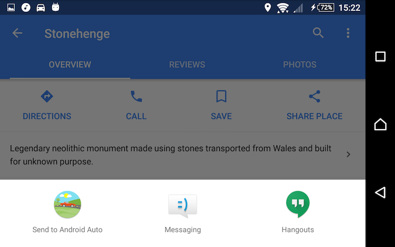
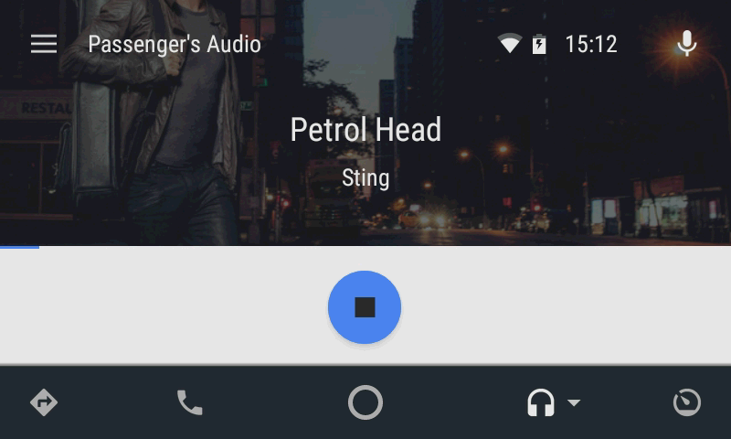
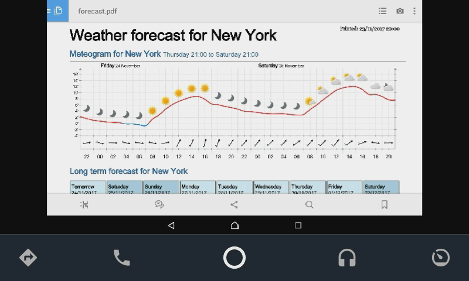

# AA Passenger – Android Auto control for passengers

This app allows a passenger to control an Android Auto device connected to the car.

Features:
 - sending navigation destinations
 
 - pushing pictures and screenshots for display
 
 - streaming audio via car speakers (requires root)
 
## Requirements
 
Two devices are needed: one would be connected to the car ("driver's device") and have Android Auto app installed.
The other ("passenger's device") will be able to control it.

The connection is established using Wi-fi Direct (P2P).
Therefore both devices must not only support it, but do it robustly.
Unfortunately this is not always the case and your mileage may vary.
Please test and report the results.

Note that this is now alpha quality, so expect some glitches and report them here:

TODO

Minimum supported Android version is 6.0 (Marshmallow).

Not supported for non-projected (on the phone screen) Android Auto, although audio streaming seems to work.

## Installation

For initial setup no car is required. :)

### Driver's device
 
1. [Download](https://github.com/martoreto/aapassenger/releases) AA Remote APK and install it on the driver's device.
 
1. Open Android Auto app and enable "Unknown sources", per
[official documentation](https://developer.android.com/training/auto/testing/index.html#phone)
or [this video](https://youtu.be/MjHpOaeOmOo).
 
### Passenger's device
 
1. [Download](https://github.com/martoreto/aapassenger/releases) AA Passenger APK, install it on the passenger's device and run.
A nice wizard will appear, guiding you through the next steps.
 
1. To enable audio streaming, another application called [Audio Capture Service](https://github.com/martoreto/audiocapture)
must me installed on the passenger's device. This requires root (or a custom recovery).
 
## Is it free?

Pre-release versions will be free. What about releases? I haven't decided yet.

I'm also open-sourcing useful reusable components of the app. For now we have:
 - the media audio redirection service (https://github.com/martoreto/audiocapture)
 - nicely packaged Opus audio codec (https://github.com/martoreto/opuscodec)
 - the unofficial Android Auto SDK build scripts (https://github.com/martoreto/aauto-sdk)

## Screenshots

